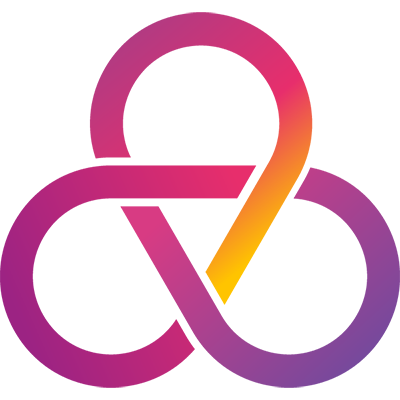

# GeniusAi

GeniusAi is a full-stack AI-powered SaaS platform that enables users to generate content, images, music, videos, and code using state-of-the-art AI models. Built with Next.js, Clerk authentication, OpenAI, and Replicate APIs, GeniusAi offers a seamless, modern, and secure user experience.



## 🚀 Features

- **AI Chatbot**: Have conversations with a smart AI assistant powered by OpenAI GPT-3.5 Turbo.
- **Image Generation**: Create unique images from text prompts using OpenAI's DALL·E.
- **Music Generation**: Generate music from text prompts using Replicate's Riffusion model.
- **Video Generation**: Create videos from prompts using Replicate's Zeroscope model.
- **Code Generation**: Generate code snippets and explanations using OpenAI.
- **User Authentication**: Secure sign-up and login with Clerk.
- **Responsive Dashboard**: Modern UI with easy navigation between AI tools.

## 🖥️ Tech Stack

- [Next.js 14](https://nextjs.org/)
- [React 18](https://react.dev/)
- [TypeScript](https://www.typescriptlang.org/)
- [Tailwind CSS](https://tailwindcss.com/)
- [Clerk](https://clerk.dev/) (Authentication)
- [OpenAI API](https://openai.com/)
- [Replicate API](https://replicate.com/)

## 📦 Getting Started

1. **Clone the repository:**
   ```bash
   git clone <your-repo-url>
   cd GeniusAi
   ```
2. **Install dependencies:**
   ```bash
   npm install
   # or
   yarn install
   ```
3. **Set up environment variables:**
   Create a `.env.local` file in the root directory and add:
   ```env
   NEXT_PUBLIC_CLERK_PUBLISHABLE_KEY=your_clerk_publishable_key
   CLERK_SECRET_KEY=your_clerk_secret_key
   OPENAI_API_KEY=your_openai_api_key
   REPLICATE_API_TOKEN=your_replicate_api_token
   ```
4. **Run the development server:**
   ```bash
   npm run dev
   # or
   yarn dev
   ```
5. **Open [http://localhost:3000](http://localhost:3000) in your browser.**

## 🛠️ Usage

- Sign up or log in with Clerk authentication.
- Access the dashboard to use:
  - **Conversation**: Chat with the AI assistant.
  - **Music Generation**: Generate music from prompts.
  - **Image Generation**: Create images from text.
  - **Video Generation**: Generate videos from prompts.
  - **Code Generation**: Get code snippets and explanations.

## 📁 Project Structure

- `app/` - Next.js app directory (routes, API, layouts)
- `components/` - Reusable UI and feature components
- `lib/` - Utility functions
- `public/` - Static assets (logo, images)

## 🌐 Deployment

Deploy easily on [Vercel](https://vercel.com/) or your preferred platform.

## 🙏 Credits

- [OpenAI](https://openai.com/)
- [Replicate](https://replicate.com/)
- [Clerk](https://clerk.dev/)
- [Next.js](https://nextjs.org/)

## 📄 License

This project is licensed under the MIT License.
